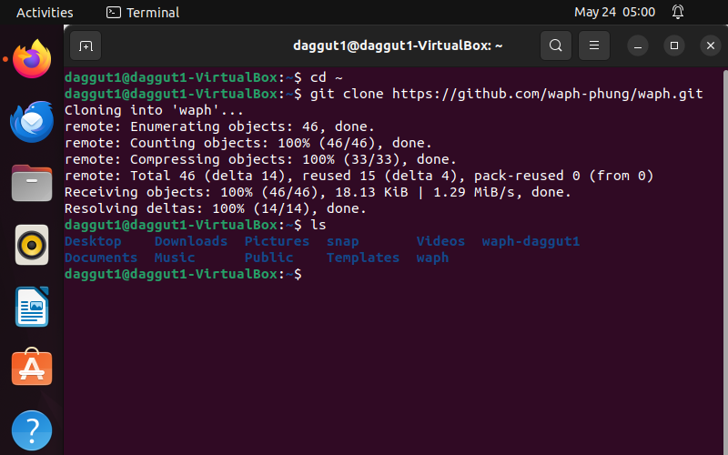

# Lab 0 – Development Environment Setup

**Course:** Web Application Programming and Hacking (WAPH)  
**Instructor:** Dr. Phu Phung  
**Name:** Thanooj daggu  
**Email:** daggut1@udayton.edu  


[View this lab on GitHub](https://github.com/daggut1/waph-daggut1/tree/main/labs/lab0)

## Part I – Ubuntu VM & Software Installation

I created an Ubuntu 22.04 VM in VirtualBox with 4 GB RAM, a 25 GB disk, and two network adapters (NAT for internet + Host-only for host→VM access).  
I then ran:
```bash
sudo apt update
sudo apt install apache2 git net-tools pandoc \ texlive-latex-base texlive-latex-extra texlive-fonts-extra
sudo snap install sublime-text --classic
```


## Part II – Git Repositories & Exercises

### The Course Repository



